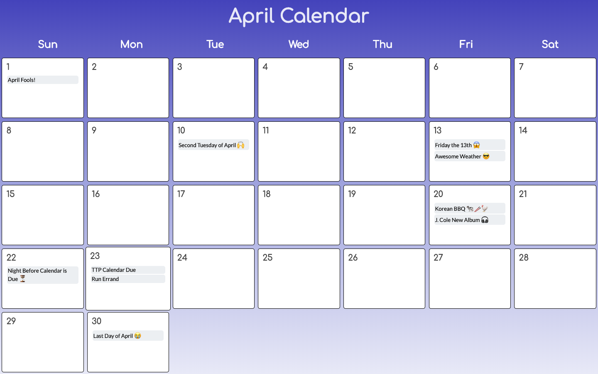

# Nadim Calendar

## Objective
A simple Calendar app where people can view and add events

## Install

### Clone the Repo
```shell
git clone https://github.com/nuddin95/ttp2-challenge.git
cd ttp2-challenge
```

### Create the Database
```shell
createdb NadimCalendar
```

### Install and Run
```shell
npm install
npm run start-dev
```
#### Go to the specified local host and you should be at the homepage

## Pictures and descriptions
<div style="text-align: center;" markdown="1" >
  <h3  markdown="1">Month Events</h3>
 
  <h3  markdown="1">Creating New Event and Viewing Single Day Event</h3>
 
</div>

## Tech Used
* [React](https://reactjs.org/)
* [Node](https://nodejs.org/en/)
* [Express](https://expressjs.com/)
* [PostgreSQL](https://www.postgresql.org/)

## Creator 
Nadim Uddin [[nuddin95](https://github.com/nuddin95)]
